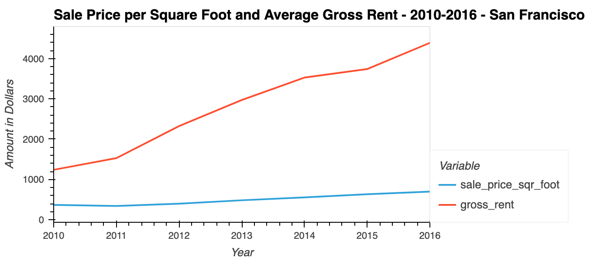
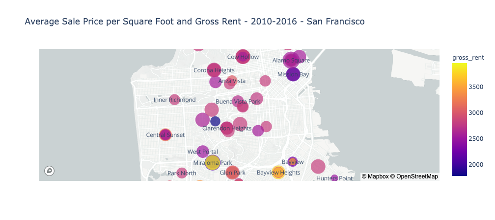

# San Francisco Housing Rental Market Data Analysis

This Jupyter lab notebook provides an analysis of the housing rental market data for San Francisco for the time period of 2010 to 2016.

Specifically, it provides:
* An interactive plot of the number housing units per year in San Francisco.
* An interactive plot showing average sale price per square foot and average gross rent for the San Francisco area.
* An interactive plot breaking down the average sale price per square foot and average gross rent on a per-neighborhood basis.
* An interactive neighborhood map that geographically shows the average sale price per square foot and average gross rent.
* A data story/analysis of the rental income growth vs sale price and whether it makes sense to develop a one-click buy-and-rent business in San Francisco based on this data.

---

## Technologies

This analysis is a Jupyter lab notebook that makes use of the following Python libraries:
* Pandas
* Pathlib
* Python Dotenv
* PyViz - hvPlot library
* PyViz - Plotly Express library
* Mapbox API

---

## Installation Guide

To use this notebook:
* Install Jupyter lab Version 2.3.1 and Python 3.7.
* Install Python Dotenv.
* Install PyViz visualization package.
* Install Plotly Express version 4.13.0.
* Install hvPlot version 0.7.0 or later.
* Install NodeJS version 12 or later.

Open the notebook in Jupyter lab and you can rerun the analysis.

---

## Examples

Here are examples of the type of interactive plots in this notebook:

---

## Contributors

Michael Danenberg

---

## License

MIT